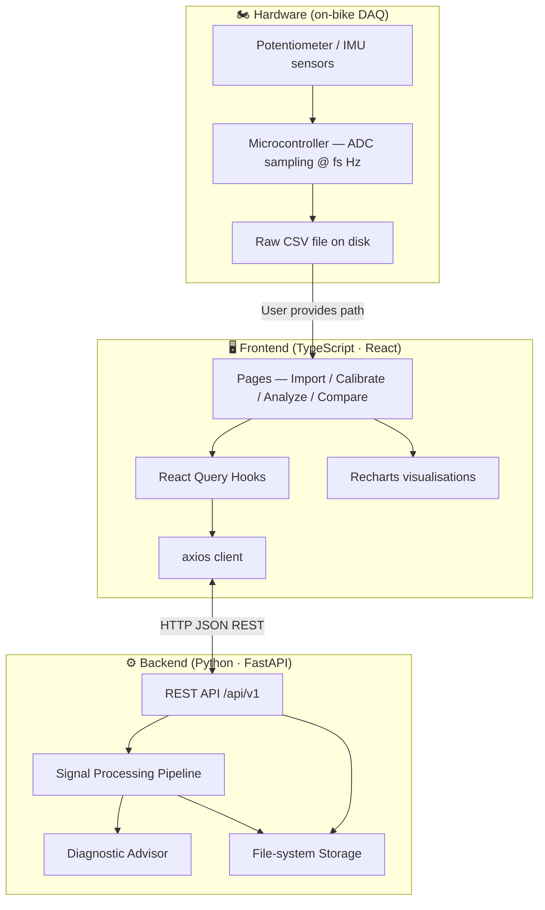

# Software Architecture — Suspension Study

> **Scope:** This directory contains the complete software architecture documentation for the Suspension Study system — a motorcycle suspension DAQ post-processor with a FastAPI backend and a React frontend.

## Sub-pages

| Document | Contents |
|----------|----------|
| [Backend Architecture](backend.md) | Layer diagram, processing pipeline, storage, diagnostic advisor |
| [Frontend Architecture](frontend.md) | Component hierarchy, routing, state management, hook / API layer |
| [API Reference](api-reference.md) | All HTTP endpoints, request/response schemas, frontend call sites |
| [End-to-End Data Flow](data-flow.md) | Signal chain from physical sensor through CSV import, processing pipeline, and UI rendering |

---

## System Context (top-down)



---

## Technology Stack

### Backend

| Concern | Library / Tool | Version constraint |
|---------|---------------|--------------------|
| HTTP framework | **FastAPI** | ≥ 0.111 |
| ASGI server | **Uvicorn** (standard) | ≥ 0.29 |
| Data validation | **Pydantic v2** | ≥ 2.7 |
| Numerical computing | **NumPy** | ≥ 1.26 |
| Signal processing | **SciPy** | ≥ 1.13 |
| Data ingestion | **pandas** | ≥ 2.2 |
| Python runtime | CPython | ≥ 3.10 |
| Test runner | **pytest** (+ httpx, pytest-asyncio) | ≥ 8 |

### Frontend

| Concern | Library / Tool | Version constraint |
|---------|---------------|--------------------|
| UI framework | **React** | ^19 |
| Build tool | **Vite** | ^8 |
| Language | **TypeScript** | ~5.9 |
| Routing | **React Router DOM** | ^6 |
| Server state | **@tanstack/react-query** | ^5 |
| HTTP client | **axios** | ^1.14 |
| Charts | **Recharts** | ^3 |
| CSS | **Tailwind CSS** | ^3 |
| Test runner | **Vitest** | ^4 |
| Component testing | **@testing-library/react** | ^16 |
| API mocking | **msw** (Mock Service Worker) | ^2 |

---

## Repository Layout

```
suspension_study/
├── backend/                    ← Python package root
│   ├── app/
│   │   ├── main.py             ← FastAPI app + router registration
│   │   ├── config.py           ← Data directory paths (~/.suspension_study)
│   │   ├── api/                ← HTTP routers (one file per resource)
│   │   ├── models/             ← Pydantic request / response schemas
│   │   ├── processing/         ← Signal processing algorithms
│   │   ├── advisor/            ← Diagnostic rule engine
│   │   ├── storage/            ← File-system persistence helpers
│   │   └── simulator/          ← Synthetic DAQ data generator (CLI + physics)
│   ├── tests/                  ← pytest test suite (35 tests)
│   └── pyproject.toml
│
├── frontend/                   ← Vite + React application
│   ├── src/
│   │   ├── api/                ← axios wrappers (one file per resource)
│   │   ├── hooks/              ← React Query hooks
│   │   ├── components/         ← Reusable UI components
│   │   ├── pages/              ← Full-page route components
│   │   ├── types/              ← TypeScript interfaces mirroring Pydantic models
│   │   └── test/               ← Vitest test infrastructure (setup, fixtures, MSW)
│   ├── __mocks__/recharts.tsx  ← jsdom-compatible recharts mock
│   ├── vitest.config.ts
│   └── package.json
│
├── .github/workflows/
│   ├── backend.yml             ← pytest CI (triggers on backend/**)
│   └── frontend.yml            ← lint + vitest CI (triggers on frontend/**)
│
└── doc/
    └── software-design/        ← This directory
```

---

## Development Quick-Start

```bash
# Backend
cd backend
pip install -e ".[dev]"
uvicorn app.main:app --reload --port 8000

# Frontend (separate terminal)
cd frontend
npm install
npm run dev          # http://localhost:5173

# Tests
cd backend && python -m pytest tests/ -v
cd frontend && npm test
```
