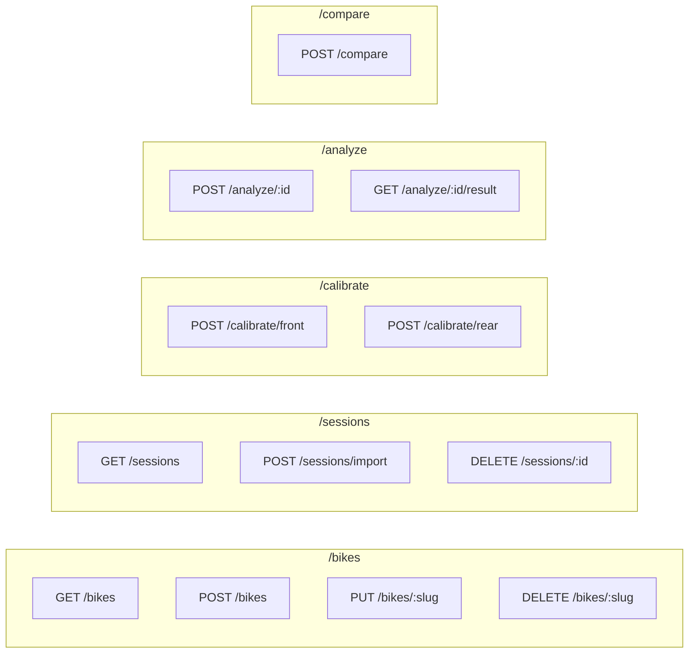
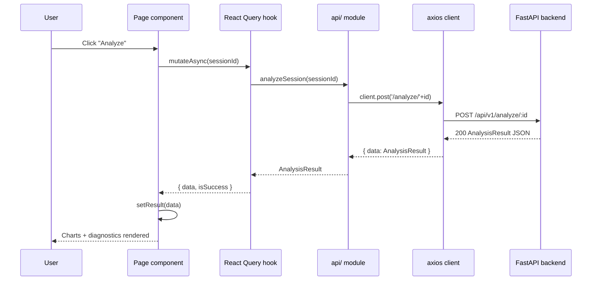

# API Reference

> Base URL: `http://localhost:8000/api/v1`  
> All requests and responses use `Content-Type: application/json`.  
> Automatic interactive documentation: `http://localhost:8000/docs` (Swagger UI).

---

## Endpoint Overview



---

## Bikes

### `GET /api/v1/bikes`

Returns all stored `BikeProfile` objects.

**Response `200`**
```json
[
  {
    "name": "Yamaha Ténéré 700",
    "slug": "t7",
    "w_max_front_mm": 210.0,
    "w_max_rear_mm": 210.0,
    "fork_angle_deg": 27.0,
    "c_front": 42.0,
    "v0_front": 0.5,
    "c_rear": 18.5,
    "v0_rear": 0.4,
    "linkage_a": -0.015,
    "linkage_b": 4.2,
    "linkage_c": 0.0,
    "adc_bits": 12,
    "v_ref": 5.0,
    "fs_hz": 250.0,
    "lpf_cutoff_disp_hz": 20.0,
    "lpf_cutoff_gyro_hz": 10.0,
    "complementary_alpha": 0.98,
    "stationary_samples": 250,
    "gyro_sensitivity": 16.4,
    "accel_sensitivity": 2048.0,
    "ls_threshold_mm_s": 150.0
  }
]
```

**Frontend call site:** `api/bikes.ts → getBikes()` → consumed by `useBikes()` hook → used by `BikeSelector`, `ImportPage`, `CalibratePage`.

---

### `POST /api/v1/bikes`

Create a new bike profile.

**Request body** — full `BikeProfile` schema (see GET response above).

**Response `201`** — created `BikeProfile`.

**Response `409`** — `{ "detail": "Bike 't7' already exists" }` if slug already in use.

**Frontend call site:** `api/bikes.ts → createBike(bike)` → `useCreateBike()` → CalibratePage "Save" button (new profile form).

---

### `PUT /api/v1/bikes/:slug`

Replace a bike profile (slug is taken from the URL path, not the body).

**Request body** — full `BikeProfile` schema.

**Response `200`** — updated `BikeProfile`.

**Frontend call site:** `api/bikes.ts → updateBike(slug, patch)` → `useUpdateBike()` → CalibratePage:
- "Apply" after front calibration fit (updates `c_front`, `v0_front`)
- "Apply" after rear calibration fit (updates `linkage_a`, `linkage_b`, `linkage_c`)
- "Save" in bike edit form

---

### `DELETE /api/v1/bikes/:slug`

Delete a bike profile.

**Response `204`** — no content.

**Response `404`** — `{ "detail": "Bike 'xyz' not found" }`.

**Frontend call site:** `api/bikes.ts → deleteBike(slug)` → `useDeleteBike()` → CalibratePage "Delete" button (after `window.confirm`).

---

## Sessions

### `GET /api/v1/sessions`

Returns all stored sessions, sorted by creation time.

**Response `200`**
```json
[
  {
    "id": "f47ac10b-58cc-4372-a567-0e02b2c3d479",
    "name": "Sunday Rocky Peak Run",
    "bike_slug": "t7",
    "csv_path": "/home/rider/rides/session01.csv",
    "column_map": {
      "time_col": "time_s",
      "front_raw_col": "front_raw",
      "rear_raw_col": "rear_raw",
      "gyro_y_col": "gyro_y_raw",
      "accel_x_col": "accel_x_raw",
      "accel_y_col": "accel_y_raw",
      "accel_z_col": "accel_z_raw",
      "invert_front": false,
      "invert_rear": false
    },
    "velocity_quantity": "wheel",
    "created_at": "2026-01-01T10:00:00Z",
    "analyzed": true
  }
]
```

**Frontend call site:** `api/sessions.ts → getSessions()` → `useSessions()` → AnalyzePage session dropdown, ComparePage session list.

---

### `POST /api/v1/sessions/import`

Register a new session. The CSV file must already exist on disk (path is validated server-side).

**Request body**
```json
{
  "csv_path": "/home/rider/rides/session01.csv",
  "name": "Sunday Rocky Peak Run",
  "bike_slug": "t7",
  "velocity_quantity": "wheel",
  "column_map": {
    "time_col": "time_s",
    "front_raw_col": "front_raw",
    "rear_raw_col": "rear_raw",
    "gyro_y_col": "gyro_y_raw",
    "accel_x_col": "accel_x_raw",
    "accel_y_col": "accel_y_raw",
    "accel_z_col": "accel_z_raw",
    "invert_front": false,
    "invert_rear": false
  }
}
```

**Response `201`** — created `Session` object.

**Response `400`** — `{ "detail": "File not found: /bad/path.csv" }`.

**Frontend call site:** `api/sessions.ts → importSession(payload)` → `useImportSession()` → ImportPage "Import Session" button.

---

### `DELETE /api/v1/sessions/:id`

Delete a session and all its associated data (including any stored analysis result).

**Response `204`** — no content.

**Response `404`** — `{ "detail": "Session 'xyz' not found" }`.

**Frontend call site:** `api/sessions.ts → deleteSession(id)` → `useDeleteSession()`.

---

## Calibration

### `POST /api/v1/calibrate/front`

Fit a linear sensor transfer function from static calibration data.

**Request body**
```json
{
  "strokes_mm":  [0, 50, 100, 150, 200],
  "voltages_v":  [0.5, 1.69, 2.88, 4.07, 5.26]
}
```

Minimum 2 points. Both arrays must be the same length.

**Response `200`**
```json
{
  "c_cal": 41.98,
  "v0": 0.4995,
  "rmse": 0.12
}
```

| Field | Meaning |
|-------|---------|
| `c_cal` | Sensor calibration constant [mm/V] — use as `c_front` in `BikeProfile` |
| `v0` | Zero-stroke voltage [V] — use as `v0_front` in `BikeProfile` |
| `rmse` | Fit residual [mm] — quality indicator |

**Frontend call site:** `api/calibrate.ts → calibrateFront(payload)` → CalibratePage "Fit" button (front panel).

---

### `POST /api/v1/calibrate/rear`

Fit a quadratic linkage polynomial W = a·s² + b·s + c.

**Request body**
```json
{
  "shock_strokes_mm":  [0, 20, 40, 60, 80],
  "wheel_travels_mm":  [0, 84, 162, 231, 290]
}
```

Minimum 3 points. Both arrays must be the same length.

**Response `200`**
```json
{
  "a": -0.0148,
  "b": 4.21,
  "c": -0.03,
  "rmse": 0.38
}
```

| Field | Meaning |
|-------|---------|
| `a`, `b`, `c` | Quadratic coefficients — use as `linkage_a/b/c` in `BikeProfile` |
| `rmse` | Fit residual [mm] |

**Frontend call site:** `api/calibrate.ts → calibrateRear(payload)` → CalibratePage "Fit" button (rear panel).

---

## Analysis

### `POST /api/v1/analyze/:id`

Run the signal processing pipeline on a previously imported session. Stores the result on disk and marks the session as `analyzed: true`.

**Response `200`** — full `AnalysisResult` (see schema below).

**Response `400`** — CSV cannot be read.

**Response `404`** — session or bike profile not found.

**Frontend call site:** `api/analyze.ts → analyzeSession(id)` → `useAnalyzeSession()` → AnalyzePage "Analyze / Re-analyze" button. Result stored in local `useState<AnalysisResult | null>`.

---

### `GET /api/v1/analyze/:id/result`

Retrieve a previously stored analysis result without re-running the pipeline.

**Response `200`** — `AnalysisResult`.

**Response `404`** — no result stored for this session yet.

**Frontend call site:** `api/analyze.ts → getResult(id)` → `useAnalysisResult(sessionId)` hook (enabled only when `sessionId` is non-null).

---

#### `AnalysisResult` schema

```json
{
  "session_id": "f47ac10b-...",
  "front_travel": {
    "centers_pct": [5, 15, 25, 35, 45, 55, 65, 75, 85, 95],
    "time_pct":    [2,  8, 25, 28, 18, 10,  5,  2,  1,  1],
    "peak_center_pct": 35.0,
    "pct_above_80": 4.0
  },
  "rear_travel": { "...": "same shape as front_travel" },
  "front_velocity": {
    "centers_mm_s": [-1475, -1425, "...", 1475],
    "time_pct":     [0.1, 0.2, "...", 0.1],
    "compression_area_pct": 48.5,
    "rebound_area_pct":     49.5,
    "ls_compression_pct":   28.0,
    "hs_compression_pct":   20.5,
    "ls_rebound_pct":       30.0,
    "hs_rebound_pct":       19.5
  },
  "rear_velocity": { "...": "same shape as front_velocity" },
  "pitch": {
    "time_s":     [0.0, 0.004, "...", 29.996],
    "pitch_deg":  [0.0, -0.1,  "...", 0.0],
    "accel_x_g":  [0.0, -0.05, "...", 0.0]
  },
  "diagnostics": [
    {
      "rule_id": "deep_travel_tail",
      "severity": "warning",
      "title": "Excessive deep-stroke usage",
      "message": "12.3% of ride time spent above 80% travel...",
      "action": "Consider fitting a stiffer spring or increasing preload."
    }
  ],
  "duration_s": 30.0,
  "sample_count": 7500
}
```

---

## Compare

### `POST /api/v1/compare`

Compare 2–3 previously analyzed sessions side-by-side.

**Request body**
```json
{
  "session_ids": ["id-1", "id-2"],
  "granularity": "session",
  "segment_duration_s": null
}
```

| Field | Values | Notes |
|-------|--------|-------|
| `session_ids` | 2–3 UUIDs | Must all have existing analysis results |
| `granularity` | `"session"` \| `"segment"` | `"segment"` not yet implemented in current API |
| `segment_duration_s` | float or null | Used only when `granularity = "segment"` |

**Response `200`**
```json
{
  "sessions": [
    {
      "session_id": "id-1",
      "session_name": "Sunday Rocky Peak Run",
      "front_travel": { "...": "TravelHistogram" },
      "rear_travel":  { "...": "TravelHistogram" },
      "front_velocity": { "...": "VelocityHistogram" },
      "rear_velocity":  { "...": "VelocityHistogram" },
      "duration_s": 30.0
    },
    { "...": "second session" }
  ],
  "granularity": "session"
}
```

**Response `400`** — fewer than 2 sessions, more than 3 sessions, or a session has not been analyzed yet.

**Response `404`** — a referenced session does not exist.

**Frontend call site:** `api/compare.ts → compareSession(payload)` → ComparePage "Compare" button (2 sessions minimum).

---

## Error Format

All error responses follow FastAPI's default schema:

```json
{
  "detail": "Human-readable error message"
}
```

The frontend `client.ts` interceptor extracts `response.data.detail` and wraps it in a plain `Error` object, so every `catch (e)` block receives `e.message === "Human-readable error message"`.

---

## How the Frontend Calls the API



The same pattern applies to all mutations. For `useQuery` hooks (bike list, session list) the call is automatic on component mount and cached by React Query.
