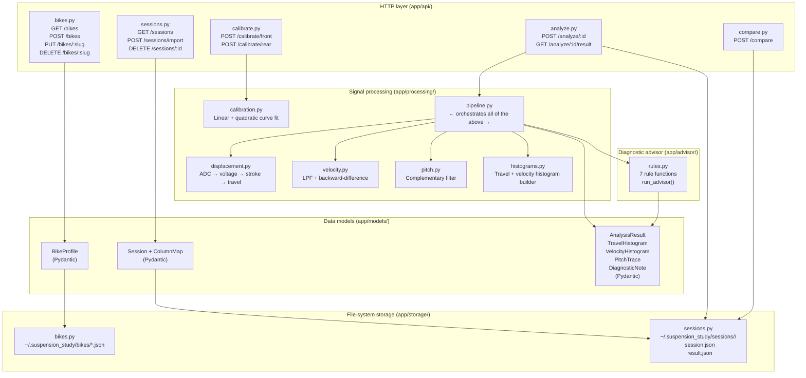
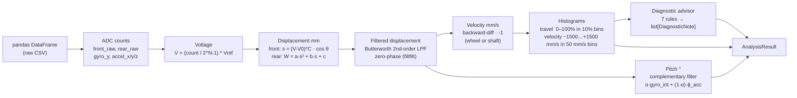
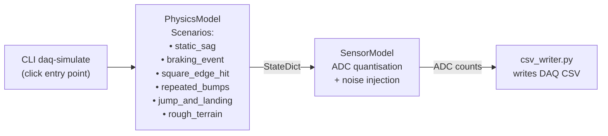

# Backend Architecture

> **Framework:** FastAPI (Python ≥ 3.10) · **ASGI server:** Uvicorn · **Validation:** Pydantic v2

---

## Layer Diagram



---

## Application Entry Point (`app/main.py`)

```
FastAPI(title="Suspension Study", version="1.0.0")
│
├── lifespan hook → storage.bikes.seed_defaults()   (seeds T7 profile on first start)
├── CORSMiddleware(allow_origins=["*"])              (dev — tighten for production)
│
└── Routers mounted at /api/v1:
    ├── /bikes
    ├── /sessions
    ├── /calibrate
    ├── /analyze
    └── /compare
```

Automatic OpenAPI docs are available at `http://localhost:8000/docs` (Swagger UI) and `http://localhost:8000/redoc`.

---

## Models (`app/models/`)

### `bike.py` — `BikeProfile`

Pydantic model with `extra="allow"` so future hardware parameters survive round-trips without schema changes.

| Field group | Fields | Physical meaning |
|-------------|--------|-----------------|
| Identity | `name`, `slug` | Human name + URL-safe identifier |
| Travel limits | `w_max_front_mm`, `w_max_rear_mm` | Full stroke for travel % normalisation |
| Geometry | `fork_angle_deg` | Projects fork-axis stroke to vertical wheel travel |
| Front calibration | `c_front`, `v0_front` | Linear sensor transfer function |
| Rear calibration | `c_rear`, `v0_rear` | Linear sensor transfer function for shock stroke |
| Linkage polynomial | `linkage_a`, `linkage_b`, `linkage_c` | W = a·s² + b·s + c |
| ADC | `adc_bits`, `v_ref` | 12-bit / 5 V default |
| Acquisition | `fs_hz` | Sample rate (250 Hz default) |
| Filters | `lpf_cutoff_disp_hz`, `lpf_cutoff_gyro_hz` | Butterworth cut-offs |
| IMU | `gyro_sensitivity`, `accel_sensitivity`, `complementary_alpha`, `stationary_samples` | CF tuning |
| Advisor | `ls_threshold_mm_s` | Low-speed / high-speed velocity boundary |

### `session.py` — `Session` + `ColumnMap`

`ColumnMap` maps physical signals to CSV column names and handles polarity inversions (`invert_front`, `invert_rear`). `Session` adds metadata (UUID id, bike reference, `analyzed` flag).

### `analysis.py` — `AnalysisResult` and sub-models

```
AnalysisResult
├── front_travel: TravelHistogram    (centers_pct, time_pct, peak_center_pct, pct_above_80)
├── rear_travel:  TravelHistogram
├── front_velocity: VelocityHistogram  (centers_mm_s, time_pct, area splits: LS-C, HS-C, LS-R, HS-R)
├── rear_velocity:  VelocityHistogram
├── pitch: PitchTrace                (time_s, pitch_deg, accel_x_g)
├── diagnostics: list[DiagnosticNote] (rule_id, severity, title, message, action)
├── duration_s: float
└── sample_count: int
```

---

## Signal Processing Pipeline (`app/processing/pipeline.py`)

`process_session(df, bike, column_map, velocity_quantity) → AnalysisResult`



### Step details

#### Displacement (`displacement.py`)

```
V_raw  = (adc / (2^N - 1)) × V_ref
s_f    = (V_raw - V0_front) × C_front           [mm, fork stroke]
W_f    = s_f × cos(fork_angle_deg)              [mm, wheel travel]

s_rear = (V_raw - V0_rear) × C_rear             [mm, shock stroke]
W_rear = linkage_a×s² + linkage_b×s + linkage_c [mm, wheel travel]

P      = 100 × W / W_max                        [% travel]
```

#### Velocity (`velocity.py`)

| Mode | Formula |
|------|---------|
| Wheel (front) | `v = −(W_f[n] − W_f[n-1]) / dt` |
| Shaft (front) | `v_shaft = v_wheel / cos(θ)` |
| Shaft (rear) | Differentiates shock stroke directly (bypasses non-constant motion ratio) |

Sign convention: **negative = compression, positive = rebound.**

#### Pitch — Complementary Filter (`pitch.py`)

```
ω_raw  = gyro_raw / sensitivity            [deg/s]
ω_corr = ω_raw − mean(ω_raw[:N_stat])     [bias-corrected]
ω_f    = LPF(ω_corr, f_cutoff_gyro)       [filtered]

ϕ_acc  = atan2(−ax_g, √(ay_g²+az_g²))    [gravity-derived pitch]

ϕ[n]   = α·(ϕ[n-1] + 0.5·(ω_f[n]+ω_f[n-1])·dt) + (1−α)·ϕ_acc[n]
```

`α = 0.98` — gyro dominates short-term; accelerometer corrects slow drift. The complementary filter is **always** applied; gyro-only integration is never used.

#### Histograms (`histograms.py`)

| Histogram | Bins | X axis | Y axis |
|-----------|------|--------|--------|
| Travel | 10 × 10% bins, edges 0–100 | Travel % | % ride time |
| Velocity | 60 × 50 mm/s bins, edges −1500…+1500 | mm/s | % ride time |

Derived statistics stored directly on the model:
- Travel: `peak_center_pct`, `pct_above_80`
- Velocity: `compression_area_pct`, `rebound_area_pct`, `ls_compression_pct`, `hs_compression_pct`, `ls_rebound_pct`, `hs_rebound_pct`

---

## Calibration (`app/processing/calibration.py`)

### Front fork — linear fit

```
s = C_cal × (V − V0)
→ polyfit(V, s, deg=1) → [m, b]
→ C_cal = m,  V0 = −b/m
→ RMSE in mm
```

### Rear linkage — quadratic fit

```
W = a·s² + b·s + c
→ polyfit(s, W, deg=2) → [a, b, c]
→ RMSE in mm
```

Minimum data requirements enforced by the API layer: ≥ 2 points (front), ≥ 3 points (rear).

---

## Diagnostic Advisor (`app/advisor/rules.py`)

Each rule is a pure function `(AnalysisResult, BikeProfile) → DiagnosticNote | None`. `run_advisor` maps all rules and collects non-`None` results.

| Rule ID | Trigger | Severity | Tuning implication |
|---------|---------|----------|--------------------|
| `deep_travel_tail` | `pct_above_80 > 10%` | warning | Spring too soft or under-preloaded |
| `travel_center_shifted_right` | `peak_center_pct > 50%` | warning | Ride height too low; increase preload |
| `travel_center_shifted_left` | `peak_center_pct < 20%` | info | Over-preloaded; spring possibly too stiff |
| `harsh_hs_compression` | `hs_compression_pct > 20%` | critical | Hydraulic lock on impacts; open HSC |
| `brake_dive` | pitch < −15° during braking and LS comp dominant | warning | Increase LSC by 2–3 clicks |
| `compression_asymmetry` | comp > reb × 1.5 | warning | Suspension packing; open rebound |
| `rebound_kickback` | reb > comp × 1.5 | warning | Pogo / kickback; close rebound |

---

## File-System Storage (`app/storage/` + `app/config.py`)

```
~/.suspension_study/
├── bikes/
│   ├── t7.json            ← seeded on startup
│   └── <slug>.json        ← one JSON file per BikeProfile
└── sessions/
    └── <uuid>/
        ├── session.json   ← Session metadata
        └── result.json    ← AnalysisResult (written after POST /analyze/:id)
```

No database. All persistence is plain JSON serialised by Pydantic's `.model_dump_json()` and validated back with `.model_validate_json()`. The storage functions are thin wrappers over `pathlib.Path` operations.

---

## Simulator (`app/simulator/`)

A standalone synthetic DAQ data generator used exclusively by the test suite.



`PhysicsModel` outputs true physical states (wheel travel mm, pitch deg, accelerations m/s²). `SensorModel` quantises those to 12-bit ADC counts and adds Gaussian noise calibrated to real sensor specs. The planted `BikeProfile` (T7) is the ground truth against which all round-trip tests verify reconstruction accuracy.

---

## Test Architecture

```
backend/tests/
├── conftest.py               ← shared fixtures: BikeProfile, DataFrame, ColumnMap
├── simulator/                ← unit tests for each simulator module
│   ├── physics.py
│   ├── sensors.py
│   ├── noise.py
│   ├── scenarios.py
│   └── csv_writer.py
├── test_displacement.py      ← ADC → travel conversion
├── test_velocity.py          ← differentiation + sign convention
├── test_pitch.py             ← complementary filter round-trip
├── test_histograms.py        ← bin counts + area statistics
├── test_calibration.py       ← polyfit accuracy
├── test_pipeline.py          ← end-to-end process_session()
└── test_advisor.py           ← each diagnostic rule
```

Run: `cd backend && python -m pytest tests/ -v` (35 tests, < 2 s).
