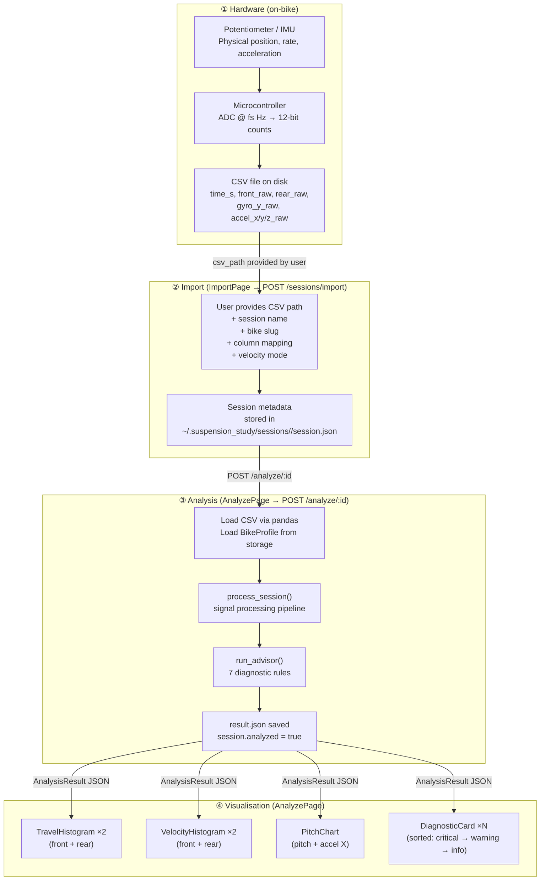
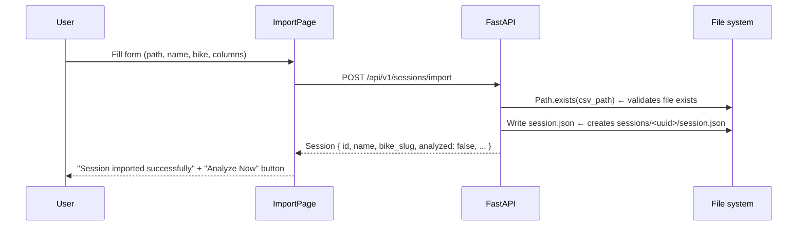
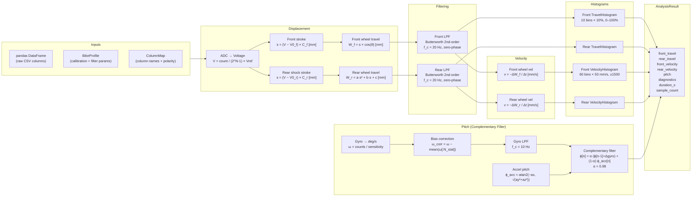
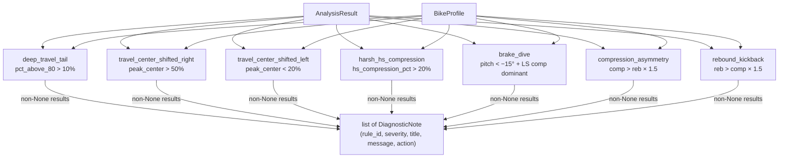
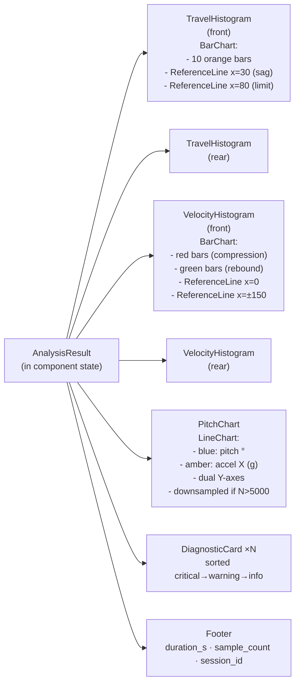
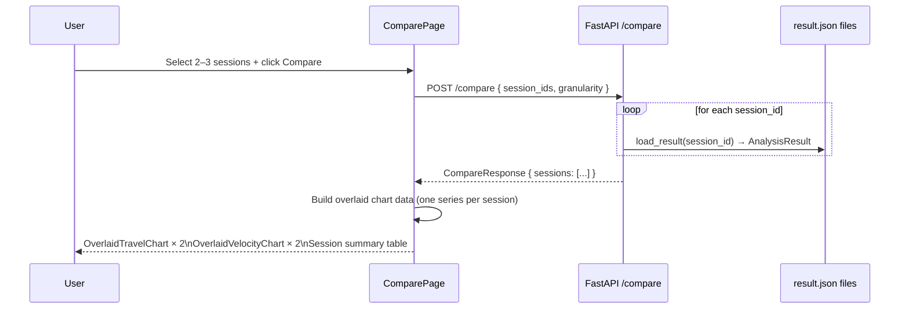
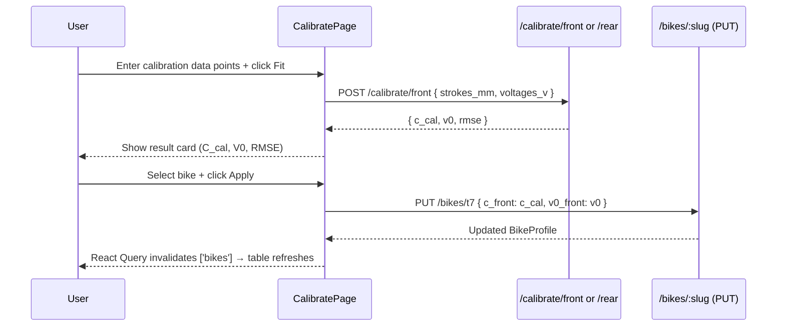

# End-to-End Data Flow

> This document traces the complete signal chain from physical sensor hardware through CSV ingestion, the signal processing pipeline, and finally to the rendered UI charts and diagnostic advice.

---

## Overview



---

## Stage 1 — Hardware Signal Acquisition

The on-bike DAQ system samples physical signals at a fixed rate `fs_hz` (default 250 Hz) using a microcontroller with a 12-bit ADC and 5 V reference.

| Column | Physical quantity | Sensor |
|--------|-----------------|--------|
| `front_raw` | Front fork sensor counts | Linear potentiometer |
| `rear_raw` | Rear shock sensor counts | Linear potentiometer |
| `gyro_y_raw` | Pitch-rate counts | MPU-6050 gyroscope (Y axis) |
| `accel_x_raw` | Longitudinal acceleration counts | MPU-6050 accelerometer (X=forward) |
| `accel_y_raw` | Lateral acceleration counts | MPU-6050 accelerometer (Y=left) |
| `accel_z_raw` | Vertical acceleration counts | MPU-6050 accelerometer (Z=up) |

IMU sign convention: X forward, Z up. At rest with pitch φ:
- `ax_specific = −g · sin(φ)`
- `az_specific = g · cos(φ)`

The CSV may optionally include a `time_s` column (actual timestamps). If absent, sample indices × `1/fs_hz` are used.

---

## Stage 2 — Import (`POST /sessions/import`)



**Column mapping** (`ColumnMap`) is stored in the session, not the CSV. This allows re-importing the same file with a different column layout or bike profile without modifying the raw data.

**Polarity flags** `invert_front` / `invert_rear` negate the raw counts before any processing — useful when a potentiometer is mounted in the reverse orientation.

---

## Stage 3 — Signal Processing Pipeline (`process_session`)



### Displacement equations

```
ADC → Voltage:
    V = count / (2^N − 1) × V_ref                        [V]

Front fork:
    s_f   = (V − V0_front) × C_front                    [mm, fork-axis stroke]
    W_f   = s_f × cos(fork_angle_deg)                   [mm, vertical wheel travel]

Rear shock:
    s_r   = (V − V0_rear) × C_rear                      [mm, shock stroke]
    W_r   = linkage_a × s_r² + linkage_b × s_r + linkage_c  [mm, wheel travel]

Travel %:
    P = 100 × W / W_max                                  [%]
```

### Filtering

A **2nd-order Butterworth** low-pass filter applied **zero-phase** via `scipy.signal.filtfilt` (forward-backward pass eliminates phase delay). Used for both displacement (20 Hz cut-off) and gyro rate (10 Hz cut-off). Minimum 13 samples required; shorter signals pass through unfiltered.

### Velocity sign convention

> **Negative = compression, positive = rebound.**

The wheel travel `W` increases as the suspension compresses (sensor extends). The time derivative is negated so that compression events appear as negative velocity in the histogram.

| Mode | Formula |
|------|---------|
| Wheel front | `v = −(W_f[n] − W_f[n-1]) / dt` |
| Shaft front | `v_shaft = v_wheel / cos(θ)` (projects vertical to fork-axis) |
| Shaft rear | Differentiates shock stroke directly: `v = −Δs_r / dt` (bypasses the non-constant linkage motion ratio) |

### Complementary filter

The filter permanently blends gyro integration (fast, drift-prone) with accelerometer-derived pitch (slow, noise-immune). The `alpha = 0.98` weighting gives the gyro 98 % influence over the short term while the accelerometer corrects drift over ~1–2 s. **Gyro-only integration is never used.**

```
ϕ_acc[n] = atan2(−ax_g[n], √(ay_g²[n] + az_g²[n]))      [deg]

ϕ[n]     = α × (ϕ[n-1] + 0.5 × (ω_f[n] + ω_f[n-1]) × dt)
           + (1 − α) × ϕ_acc[n]
```

Trapezoidal (midpoint) integration of the gyro increment suppresses numerical drift caused by the backward-Euler scheme.

---

## Stage 4 — Diagnostic Advisor (`run_advisor`)



Each rule is a pure function. Rules that do not trigger return `None` and are silently dropped. Exceptions inside rules are swallowed so one misbehaving rule cannot abort the pipeline.

---

## Stage 5 — Storage and Retrieval

```
POST /analyze/:id
  ↓
process_session() → AnalysisResult
  ↓
session_store.save_result(session_id, result)  → sessions/<id>/result.json
session.analyzed = True
session_store.save_session(session)            → sessions/<id>/session.json
  ↓
Return AnalysisResult to frontend
```

**Subsequent reads** (GET /analyze/:id/result, POST /compare) load from `result.json` — no reprocessing.

---

## Stage 6 — Frontend Rendering



### Down-sampling in `PitchChart`

When `sampleCount > 5000` a step of 4 is applied before building `chartData`:

```ts
const step = sampleCount > 5000 ? 4 : 1;
const chartData = data.time_s
  .filter((_, i) => i % step === 0)
  .map((t, i) => ({ time: t.toFixed(2), pitch: data.pitch_deg[i * step], accel: data.accel_x_g[i * step] }));
```

A 30-second session at 250 Hz → 7 500 samples → rendered as ~1 875 points. This keeps the LineChart responsive without losing perceptible detail at the pixel level of a web chart.

### Diagnostic sort

Diagnostics are sorted by severity before rendering:

```ts
const SEVERITY_ORDER = { critical: 0, warning: 1, info: 2 } as const;
sortedDiagnostics = [...result.diagnostics].sort(
  (a, b) => SEVERITY_ORDER[a.severity] - SEVERITY_ORDER[b.severity]
);
```

Critical issues always appear first, giving the rider the most urgent feedback at the top.

---

## Compare Flow



The compare endpoint reads pre-computed `result.json` files; it does not re-run the pipeline. Sessions must be analyzed before they can be compared (the frontend shows them as "analyzed ✓" in the session list).

---

## Calibration Flow

Calibration is a separate stateless computation that feeds into a `BikeProfile` update.



The same pattern applies to rear calibration, writing `linkage_a/b/c` back to the profile.
