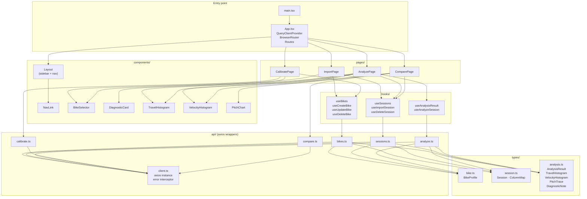
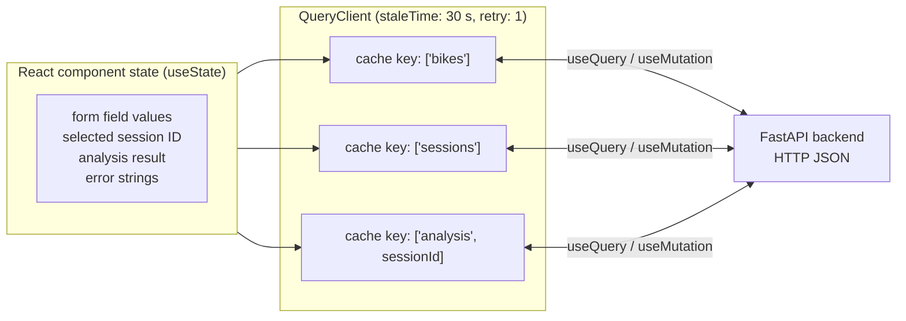
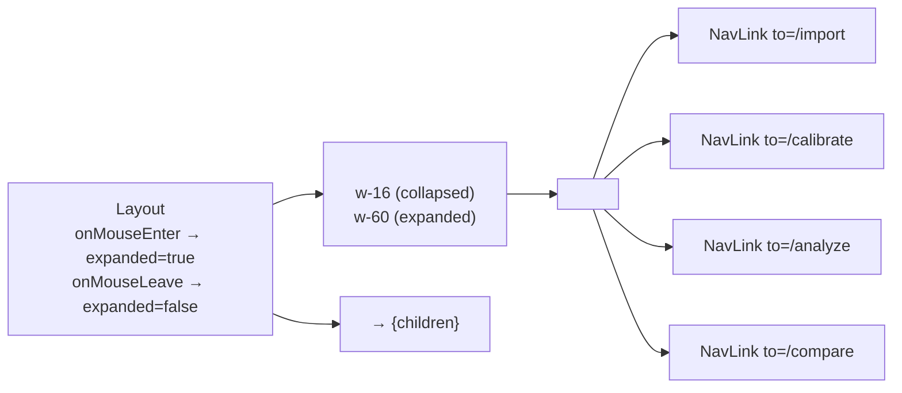

# Frontend Architecture

> **Framework:** React 19 · **Build tool:** Vite 8 · **Language:** TypeScript 5.9  
> **Routing:** React Router v6 · **Server state:** TanStack React Query v5 · **HTTP:** axios · **Charts:** Recharts

---

## Module Map



---

## Routing

Routing is handled by React Router v6. All routes are wrapped in `<Layout>` so the sidebar is always present.

```
/           → redirect to /import
/import     → ImportPage
/calibrate  → CalibratePage
/analyze    → AnalyzePage   (?session=<id> pre-selects the session)
/compare    → ComparePage
```

The `<Layout>` component renders a collapsible sidebar (expands on mouse-enter, collapses on mouse-leave). `<NavLink>` uses React Router's `isActive` callback to apply the `bg-orange-500` class to the currently active route.

---

## State Management



**React Query** manages all server state (caching, background refetch, loading/error flags). Local `useState` is used only for ephemeral UI state such as form inputs and the current analysis result (which is set by a mutation callback, not stored in the cache).

### Cache invalidation

| Mutation | Queries invalidated |
|---------|---------------------|
| `createBike`, `updateBike`, `deleteBike` | `['bikes']` |
| `importSession`, `deleteSession` | `['sessions']` |

---

## API Layer (`src/api/`)

### `client.ts`

```ts
const client = axios.create({
  baseURL: 'http://localhost:8000/api/v1',
  timeout: 30_000,
});

// Error interceptor: extract response.data.detail, fall back to err.message
client.interceptors.response.use(
  (r) => r,
  (err) => Promise.reject(new Error(err.response?.data?.detail ?? err.message))
);
```

All API modules import and use this single instance. The error interceptor converts every HTTP error into a plain `Error` with the backend's `detail` message, so page-level `catch` blocks receive a human-readable string.

### API modules — method summary

| File | Functions | HTTP method + path |
|------|-----------|-------------------|
| `bikes.ts` | `getBikes` | GET /bikes |
| | `createBike(bike)` | POST /bikes |
| | `updateBike(slug, patch)` | PUT /bikes/:slug |
| | `deleteBike(slug)` | DELETE /bikes/:slug |
| `sessions.ts` | `getSessions` | GET /sessions |
| | `importSession(payload)` | POST /sessions/import |
| | `deleteSession(id)` | DELETE /sessions/:id |
| `analyze.ts` | `analyzeSession(id)` | POST /analyze/:id |
| | `getResult(id)` | GET /analyze/:id/result |
| `calibrate.ts` | `calibrateFront(payload)` | POST /calibrate/front |
| | `calibrateRear(payload)` | POST /calibrate/rear |
| `compare.ts` | `compareSession(payload)` | POST /compare |

---

## React Query Hooks (`src/hooks/`)

### `useBikes.ts`

```ts
useBikes()          → useQuery(['bikes'], getBikes)
useCreateBike()     → useMutation(createBike, { onSuccess: invalidate(['bikes']) })
useUpdateBike()     → useMutation({ slug, bike } → updateBike(slug, bike), { onSuccess: invalidate(['bikes']) })
useDeleteBike()     → useMutation(deleteBike, { onSuccess: invalidate(['bikes']) })
```

### `useSessions.ts`

```ts
useSessions()       → useQuery(['sessions'], getSessions)
useImportSession()  → useMutation(importSession, { onSuccess: invalidate(['sessions']) })
useDeleteSession()  → useMutation(deleteSession, { onSuccess: invalidate(['sessions']) })
```

### `useAnalysis.ts`

```ts
useAnalysisResult(sessionId)  → useQuery(['analysis', sessionId], getResult, { enabled: !!sessionId })
useAnalyzeSession()           → useMutation(analyzeSession)   // caller stores result in local state
```

---

## Pages

### ImportPage

```
ImportPage
├── BikeSelector      ← populated via useBikes()
├── Inputs            ← csv_path, name, velocity_quantity, ColumnMap fields
├── useImportSession  ← mutation
│   ├── on success → show "Session imported" banner + "Analyze Now" button
│   └── on error   → show error banner
└── navigate('/analyze?session=<id>') on "Analyze Now"
```

The Import button is **disabled** until all three required fields are non-empty: `csvPath`, `sessionName`, and `bikeSlug`.

### CalibratePage

Two independent calibration panels (front fork, rear linkage) plus the Bike Profile manager.

```
CalibratePage
├── Front calibration panel
│   ├── Editable table (stroke_mm, voltage_v rows)
│   ├── "Fit" → calibrateFront() (direct useMutation, not a hook)
│   ├── Result card (C_cal, V0, RMSE)
│   └── Apply → updateBike({ c_front, v0_front })
├── Rear calibration panel
│   ├── Editable table (shock_stroke_mm, wheel_travel_mm rows)
│   ├── "Fit" → calibrateRear()
│   ├── Result card (a, b, c, RMSE)
│   └── Apply → updateBike({ linkage_a, linkage_b, linkage_c })
└── Bike Profile manager
    ├── Table of existing BikeProfiles (useBikes)
    ├── Edit → pre-populate form → updateBike
    ├── Delete → window.confirm → deleteBike
    └── New Profile → form → createBike
```

### AnalyzePage

```
AnalyzePage
├── Session selector  ← useSessions()
├── "Analyze" button  → useAnalyzeSession() → POST /analyze/:id
│   result stored in useState<AnalysisResult | null>
├── (result) →
│   ├── TravelHistogram (front)
│   ├── TravelHistogram (rear)
│   ├── VelocityHistogram (front)
│   ├── VelocityHistogram (rear)
│   ├── PitchChart
│   ├── DiagnosticCard × N  (sorted: critical → warning → info)
│   └── Footer (duration, sample count, session ID)
└── URL param ?session=<id> pre-selects session via useSearchParams
```

### ComparePage

```
ComparePage
├── Session checkboxes (≤ 3, via useSessions)
├── Granularity radio  (session | segment + duration input)
├── "Compare" button   → compareSession() → POST /compare
├── (result) →
│   ├── OverlaidTravelChart  (front)
│   ├── OverlaidTravelChart  (rear)
│   ├── OverlaidVelocityChart (front)
│   ├── OverlaidVelocityChart (rear)
│   └── Session summary table
```

Color assignment: first selected session = `#f97316` (orange), second = `#3b82f6` (blue), third = `#22c55e` (green).

---

## Components

### `Layout` + `NavLink`



`NavLink` uses React Router's `NavLink` with an `isActive` render-prop to toggle between `bg-orange-500 text-white` (active) and `text-gray-400 hover:bg-gray-800` (inactive). The label text is conditionally rendered only when `expanded === true`.

### Chart Components

| Component | Input prop | Recharts element | Key annotations |
|-----------|-----------|-----------------|-----------------|
| `TravelHistogram` | `TravelHistogram` | `BarChart` | `ReferenceLine x="30"` (sag), `ReferenceLine x="80"` (80% limit) |
| `VelocityHistogram` | `VelocityHistogram` | `BarChart` | `Cell` coloured red (comp) / green (reb); `ReferenceLine x="0"`, `x="-150"`, `x="150"` |
| `PitchChart` | `PitchTrace + sampleCount` | `LineChart` | Dual Y-axes (pitch °, accel X g); downsamples when `sampleCount > 5000` |

All charts use `<ResponsiveContainer width="100%" height={N}>` so they adapt to available width.

### `BikeSelector`

Pure controlled `<select>` component. Renders a placeholder `<option value="">` and one `<option>` per `BikeProfile`. Calls `onChange(slug)` on change event.

### `DiagnosticCard`

Renders one `DiagnosticNote`. Style is driven by a `severity → CSS class` lookup table:

| Severity | Border | Background | Badge |
|----------|--------|-----------|-------|
| `info` | `border-gray-400` | `bg-gray-50` | `bg-gray-200 text-gray-700` |
| `warning` | `border-yellow-400` | `bg-yellow-50` | `bg-yellow-200 text-yellow-800` |
| `critical` | `border-red-500` | `bg-red-50` | `bg-red-200 text-red-800` |

---

## TypeScript Types (`src/types/`)

The types mirror the Pydantic models on the backend 1:1.

```ts
// analysis.ts
interface TravelHistogram    { centers_pct, time_pct, peak_center_pct, pct_above_80 }
interface VelocityHistogram  { centers_mm_s, time_pct, compression_area_pct, rebound_area_pct,
                               ls_compression_pct, hs_compression_pct, ls_rebound_pct, hs_rebound_pct }
interface PitchTrace         { time_s, pitch_deg, accel_x_g }
interface DiagnosticNote     { rule_id, severity: 'info'|'warning'|'critical', title, message, action }
interface AnalysisResult     { session_id, front_travel, rear_travel, front_velocity, rear_velocity,
                               pitch, diagnostics, duration_s, sample_count }

// bike.ts
interface BikeProfile        { name, slug, w_max_front_mm, w_max_rear_mm, fork_angle_deg,
                               c_front, v0_front, c_rear, v0_rear,
                               linkage_a, linkage_b, linkage_c,
                               adc_bits, v_ref, fs_hz,
                               lpf_cutoff_disp_hz, lpf_cutoff_gyro_hz,
                               complementary_alpha, stationary_samples,
                               gyro_sensitivity, accel_sensitivity, ls_threshold_mm_s }

// session.ts
interface ColumnMap          { time_col, front_raw_col, rear_raw_col, gyro_y_col,
                               accel_x_col, accel_y_col, accel_z_col,
                               invert_front, invert_rear }
interface Session            { id, name, bike_slug, csv_path, column_map,
                               velocity_quantity: 'wheel'|'shaft', created_at, analyzed }
```

---

## Test Infrastructure (`src/test/`)

```
src/test/
├── setup.ts                 ← @testing-library/jest-dom + ResizeObserver mock + MSW lifecycle
├── fixtures.ts              ← typed BikeProfile, Session×2, AnalysisResult, calibration results
├── server.ts                ← MSW setupServer with handlers for all 12 endpoints
└── renderWithProviders.tsx  ← RTL render wrapper: QueryClient + MemoryRouter
                                makeQueryWrapper() for renderHook tests

__mocks__/recharts.tsx       ← jsdom-compatible: ResponsiveContainer → <div>, all chart
                                primitives → null; keeps chart component tests fast
```

Run: `cd frontend && npm test` (80 tests, 15 files, ~10 s).
